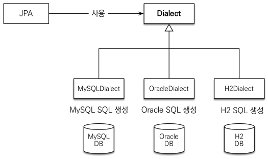
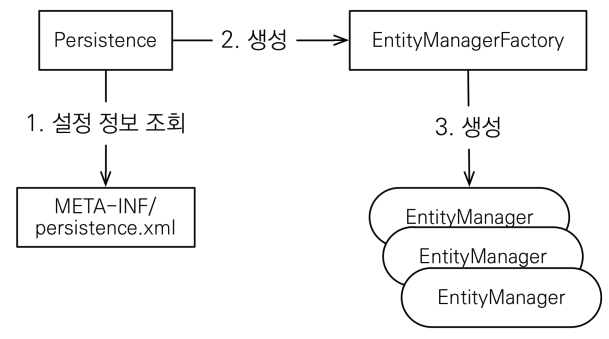

# JPA 시작

## 스프링 없이 jpa 시작하기

### 1. maven 프로젝트 생성 (java 8 이상)

### 2. pom.xml에 필요한 의존성 추가

- ```xml
  <?xml version="1.0" encoding="UTF-8"?>
  <project xmlns="http://maven.apache.org/POM/4.0.0"
    xmlns:xsi="http://www.w3.org/2001/XMLSchema-instance"
    xsi:schemaLocation="http://maven.apache.org/POM/4.0.0 http://maven.apache.org/xsd/maven-4.0.0.xsd">
    <modelVersion>4.0.0</modelVersion>

    <groupId>jpa-basic</groupId>
    <artifactId>ex1-hello-jpa</artifactId>
    <version>1.0.0</version>

    <properties>
      <maven.compiler.source>19</maven.compiler.source>
      <maven.compiler.target>19</maven.compiler.target>
      <project.build.sourceEncoding>UTF-8</project.build.sourceEncoding>
    </properties>

    <dependencies>
      <!-- jdk 11 이상은 jaxb 라이브러리를 따로 추가해주어야 한다. https://roadrunner.tistory.com/645 -->
      <dependency>
        <groupId>javax.xml.bind</groupId>
        <artifactId>jaxb-api</artifactId>
        <version>2.3.0</version>
      </dependency>

      <!-- JPA 하이버네이트 -->
      <dependency>
        <groupId>org.hibernate</groupId>
        <artifactId>hibernate-entitymanager</artifactId>
        <version>5.3.10.Final</version>
      </dependency>
      <!-- H2 데이터베이스 -->
      <dependency>
        <groupId>com.h2database</groupId>
        <artifactId>h2</artifactId>
        <version>1.4.199</version>
      </dependency>
    </dependencies>

  </project>
  ```

### 3. jpa 설정 파일 추가 (src/main/resources/META-INF/persistence.xml)

- ```xml
  <?xml version="1.0" encoding="UTF-8"?>
  <persistence version="2.2"
    xmlns="http://xmlns.jcp.org/xml/ns/persistence"
    xmlns:xsi="http://www.w3.org/2001/XMLSchema-instance"
    xsi:schemaLocation="http://xmlns.jcp.org/xml/ns/persistence http://xmlns.jcp.org/xml/ns/persistence/persistence_2_2.xsd">

    <!-- name="hello"의 값은 나중에 EntityManagerFactory를 가져올 때 구분자로써 사용된다. -->
    <persistence-unit name="hello">
      <properties>
        <!-- 필수 속성 -->
        <property name="javax.persistence.jdbc.driver" value="org.h2.Driver"/>
        <property name="javax.persistence.jdbc.user" value="sa"/>
        <property name="javax.persistence.jdbc.password" value=""/>
        <property name="javax.persistence.jdbc.url" value="jdbc:h2:tcp://localhost/~/test"/>
        <property name="hibernate.dialect" value="org.hibernate.dialect.H2Dialect"/>

        <!-- 옵션 -->
        <property name="hibernate.show_sql" value="true"/>
        <property name="hibernate.format_sql" value="true"/>
        <property name="hibernate.use_sql_comments" value="true"/>
        <!--<property name="hibernate.hbm2ddl.auto" value="create" />-->
      </properties>
    </persistence-unit>

  </persistence>
  ```

  - 데이터베이스 방언 (DB Dialect)
    - 데이터베이스 별로 SQL 문법과 함수가 조금씩 다르다.
    - JPA는 특정 데이터베이스에 종속되지 않는다. 따라서 JPA는 하나의 코드로 여러 데이터베이스에서 사용될 수 있도록 방언 기능을 제공한다.
    - 

### 4. JPA Entity 생성하기

- ```java
  package helloJpa;

  import javax.persistence.Entity;
  import javax.persistence.Id;

  @Entity
  public class Member {

      @Id
      private Long id;
      private String name;

      public Long getId() {
          return id;
      }

      public void setId(Long id) {
          this.id = id;
      }

      public String getName() {
          return name;
      }

      public void setName(String name) {
          this.name = name;
      }

  }
  ```

  - `@Entity` : JPA가 관리할 객체
  - `@Id` : DB PK와 매핑

### 5. `main()` 함수 생성

- JPA 구동 방식
  - 
  - EntityManagerFactory는 애플리케이션 전체에서 단 하나만 생성하여야 한다.
  - EntityManager는 쓰레드 간 공유해선 안되며, 사용하고 버려야 한다.
  - JPA의 모든 데이터 변경은 EntityManager에서 생성된 트랜잭션 안에서 실행하여야 한다.
- main() 함수에서 EntityMangerFactory, EntityManger, Transaction 생성해보기

  - ```java
    EntityManagerFactory emf = Persistence.createEntityManagerFactory("hello");

    EntityManager em = emf.createEntityManager();

    EntityTransaction tx = em.getTransaction();

    tx.begin();

    try {
        // do something
        tx.commit();
    } catch (Exception e) {
        tx.rollback();
    } finally {
        em.close();
    }

    emf.close();

    ```

### 6. `Member` 로직 작성

#### `Member` 추가

```java
EntityManagerFactory emf = Persistence.createEntityManagerFactory("hello");
EntityManager em = emf.createEntityManager();
EntityTransaction tx = em.getTransaction();
tx.begin();

try {
    Member member = new Member();
    member.setId(1L);
    member.setName("HelloA");
    em.persist(member);

    tx.commit();
} catch (Exception e) {
    tx.rollback();
} finally {
    em.close();
}

emf.close();
```

#### `Member` 조회한 뒤 수정

```java
EntityManagerFactory emf = Persistence.createEntityManagerFactory("hello");
EntityManager em = emf.createEntityManager();
EntityTransaction tx = em.getTransaction();
tx.begin();

try {
    Member findMember = em.find(Member.class, 1L);
    System.out.println("findMember.id = " + findMember.getId());
    System.out.println("findMember.name = " + findMember.getName());
    findMember.setName("HelloHello");
    em.persist(findMember);

    tx.commit();
} catch (Exception e) {
    tx.rollback();
} finally {
    em.close();
}

emf.close();
```

#### JPQL을 활용하여 모든 `Member` 조회

- JPQL
  - 수많은 테이블을 조인해야 하는 쿼리나, 제한성 쿼리와 같은 경우 JPA로 다루기 어려울 때가 있다.
  - JPA는 SQL을 추상화한 JPQL이라는 객체 지향 쿼리 언어를 제공한다. SQL을 추상화해서 특정 데이터베이스 SQL에 종속되지 않는다.
  - JPQL은 엔티티 객체를 대상으로 쿼리
  - SQL은 데이터베이스 테이블을 대상으로 쿼리

```java
EntityManagerFactory emf = Persistence.createEntityManagerFactory("hello");
EntityManager em = emf.createEntityManager();
EntityTransaction tx = em.getTransaction();
tx.begin();

try {
    List<Member> result = em.createQuery("select m from Member as m", Member.class)
        .getResultList();
    for (Member mem : result) {
        System.out.println("findMember.id = " + mem.getId());
        System.out.println("findMember.name = " + mem.getName());
    }

    tx.commit();
} catch (Exception e) {
    tx.rollback();
} finally {
    em.close();
}

emf.close();
```
