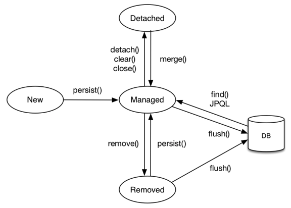
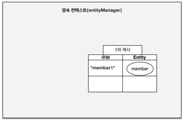
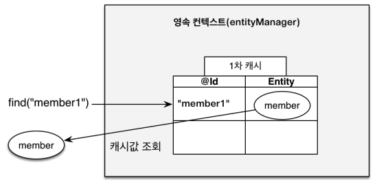
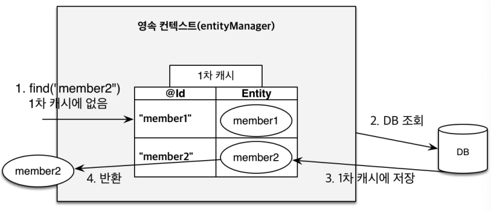
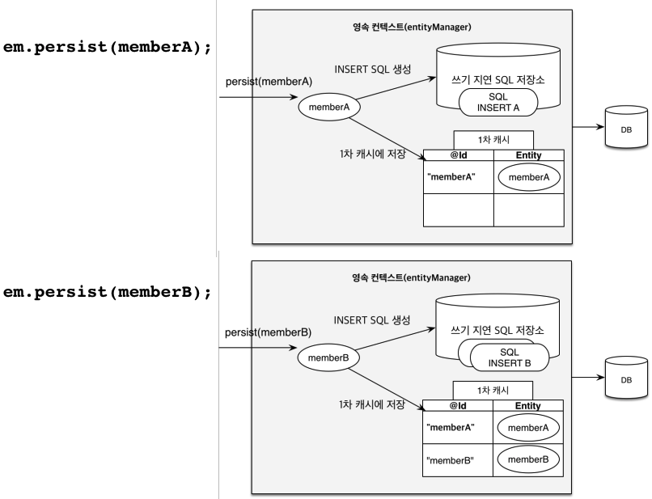
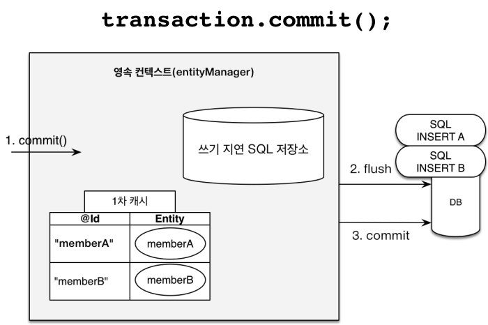
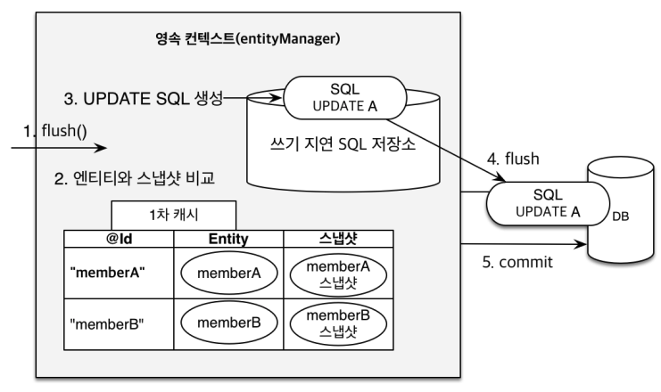

# 영속성 컨텍스트 및 영속성 관리

## 영속성 컨텍스트 (Persistence Context)

- **엔티티를 영구 저장하는 환경**
  - `EntityManager.persist(entity);`
- 영속성 컨텍스트는 논리적인 개념이다.
- EntityManger를 통해 영속성 컨텍스트에 접근할 수 있다. (`persist`, `detach`, `clear`, ...)
- J2SE 환경에서는 EntityManager와 영속성 컨텍스트가 1:1 관계고, J2EE/Spring과 같은 컨테이너 환경에서는 EntityManager와 영속성 컨텍스트가 N:1 관계다.
- 이점 : 1차 캐시, 동일성(identity) 보장, 트랜잭션을 지원하는 쓰기 지연(transactional write-behind), 변경 감지 (dirty checking), 지연 로딩 (lazy loading)

## 엔티티의 생명 주기

- 
  - 비영속 (New/Transient) : 영속성 컨텍스트와 전혀 관계가 없는 새로운 상태
  - 영속 (Managed) : 영속성 컨텍스트에 관리되고 있는 상태
  - 준영속 (Detached) : 영속성 컨텍스트에 저장되었다가 분리된 상태
  - 삭제 (Removed) : 삭제된 상태

```java
// 비영속
Member member = new Member(1L, "glory");

// 영속 : 영속성 컨텍스트가 member를 관리하도록 지정
em.persist(member);

// 준영속 : member를 영속성 컨텍스트로부터 분리함
em.detach(member);
em.clear(); // 영속성 컨텍스트를 완전히 초기화

// 삭제 : Entity 삭제
em.remove(member);
```

- 준영속 vs 비영속
  - 준영속과 비영속은 둘 다 영속성 컨텍스트에서 관리하지 않는다는 공통점이 있다.
  - 비영속은 단 한번도 영속 상태가 된 적이 없고, 준영속은 한번이라도 영속 상태가 된 적이 있다는 차이가 있다. 준영속 상태의 엔티티는 늘 식별자가 존재하기 된다.

## 영속성 컨텍스트의 이점

### 1차 캐시

- 영속성 컨텍스트 내부에 `@Id`의 값과 Entity를 캐싱하는 1차 캐시 공간이 존재한다. 영속 상태의 `@Id`의 값과 Entity가 저장된다.

- Entity 하나를 영속한 예시

  - 
  - ```java
    Member member = new Member(1L, "glory");

    // member는 영속 상태, 1차 캐시에 저장
    em.persist(member);
    ```

- Entity 하나가 영속되어 있고, 그 `@Id`를 조회하는 `em.find` 함수를 호출하면, SELECT 쿼리를 수행하는 것이 아닌, 1차 캐시의 값을 가져온다.

  - 
  - ```java
    Member member = new Member(1L, "glory");

    // member는 영속 상태, 1차 캐시에 저장
    em.persist(member);

    // 1차 캐시에서 조회
    Member findMember = em.find(Member.class, "member1");
    ```

- 1차 캐시에 없는 Entity를 조회하면, DB 조회를 하여 1차 캐시에 저장한다.
  - 
  - ```java
    Member findMember2 = em.find(Member.class, "member2");
    ```

### 동일성(identity) 보장

```java
Member a = em.find(Member.class, "member1");
Member b = em.find(Member.class, "member1");
System.out.println(a == b); // true
```

- 1차 캐시로 REPEATABLE READ 등급의 트랜잭션 격리 수준을 데이터베이스가 아닌 애플리케이션 차원에서 제공할 수 있다.

### 트랜잭션을 지원하는 쓰기 지연(transactional write-behind)

- 영속하는 순간 데이터베이스에 DDL 쿼리를 수행하는 것이 아니라, EntityManager가 생성한 EntityTransaction에서 커밋을 수행하는 시점에 DDL 쿼리를 수행한다.

```java
EntityManager em = emf.createEntityManager();
EntityTransaction transaction = em.getTransaction();

// 엔티티 매니저는 데이터 변경시 트랜잭션을 시작해야 한다.
transaction.begin(); // [트랜잭션] 시작

em.persist(memberA);
em.persist(memberB);
// 여기까지 INSERT SQL을 데이터베이스에 보내지 않는다.

// 커밋하는 순간 데이터베이스에 INSERT SQL을 보낸다.
transaction.commit(); // [트랜잭션] 커밋
```

- 
- 

### 변경 감지 (dirty checking)

- `transaction.commit()` 수행 시점에, 1차 캐시의 Entity와 데이터베이스에서 최초 조회한 값인 스냅샷과 비교하여, 변경 감지를 한다. 변경된 값들이 있다면, 데이터베이스의 값을 1차 캐시의 Entity로 바꾸기 위한 DDL을 만들어 데이터베이스로 쿼리를 수행한다.

- 
- ```java
  EntityManager em = emf.createEntityManager();
  EntityTransaction transaction = em.getTransaction();
  transaction.begin();

  // 영속 엔티티 조회
  Member memberA = em.find(Member.class, "memberA");

  // 영속 엔티티 데이터 수정
  memberA.setUsername("hi");
  memberA.setAge(10);

  transaction.commit(); // [트랜잭션] 커밋
  // 커밋 시점에서 memberA의 스냅샷과 변경된 Entity를 비교해, 쓰기 지연 SQL 저장소에서 UPDATE문을 생성하여 데이터베이스에 수행시킨다.
  ```

- 참고로, 엔티티 삭제를 위해 `em.remove(memberA);` 메서드를 사용하면 된다.

### 지연 로딩 (lazy loading)

## flush

- 영속성 컨텍스트의 변경내용을 데이터베이스에 반영한다. 즉, 실제 데이터베이스에 쿼리를 수행하는 작업이 플러시다.
- 플러시 수행 후 영속성 컨텍스트를 비우지 않는다.

- 플러시를 호출하는 방법

  - [수동 호출] `em.flush()`
  - [자동 호출] 트랜잭션 커밋
  - [자동 호출] JPQL 쿼리 실행

- 플러시 모드 옵션
  - `em.setFlushMode(FlushModeType.COMMIT);`
  - `FlushModeType.AUTO` : 기본값. 권장. 커밋이나 쿼리를 실행할 때 플러시
  - `FlushModeType.COMMIT` : 커밋할 때만 플러시
