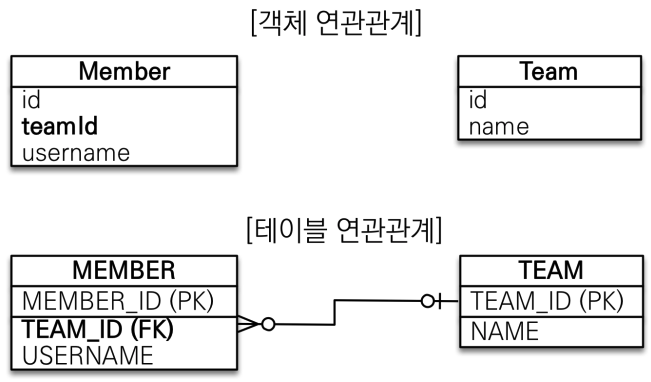
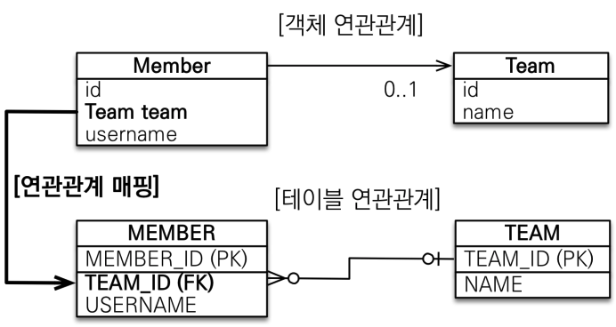
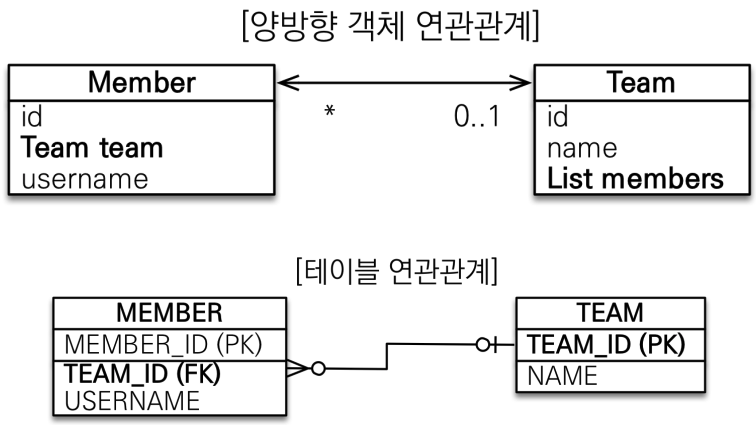

# 연관관계 매핑 기초

- 객체의 참조와 테이블의 외래키를 매핑해야 한다.

## 연관관계가 필요한 이유

- 테이블 구조를 그대로 객체로 구현하면, 객체지향 설계가 어려워진다.
- 테이블 연관관계를 토대로 그대로 객체에 구현하면 아래와 같은 구조가 된다.

  - 
  - ```java
    @Entity
    public class Member {

        @Id
        @GeneratedValue
        private Long id;

        @Column(name = "USERNAME")
        private String name;

        @Column(name = "TEAM_ID")
        private Long teamId;
    }
    ```

  - ```java
    @Entity
    public class Team {

        @Id
        @GeneratedValue
        @Column(name = "TEAM_ID")
        private Long id;

        private String name;
    }
    ```

  - ```java
    // main 함수
    Team team = new Team();
    team.setName("TeamA");
    em.persist(team);

    Member member = new Member();
    member.setName("member1");
    member.setTeamId(team.getId());
    em.persist(member);

    // member 객체로부터 teamId를 가져와 다시 team 객체를 찾는 것은 객체지향적이지 않다.
    Member findMember = em.find(Member.class, member.etId());
    Long findTeamId = findMember.getTeamId();
    Team findTeam = em.find(Team.class, findTeamId);
    ```

- 결론 : 객체를 테이블에 맞추어 데이터 중심으로 모델링하면, 협력 관계를 만들 수 없다.
  - 테이블은 외래 키로 조인을 사용해서 연관된 테이블을 찾는다.
  - 객체는 참조를 사용해서 연관된 객체를 찾는다.
  - 위와 같은 차이점을, JPA가 제공하는 방향, 다중성, 연관관계의 주인을 통해 패러다임 불일치를 극복해보자.

## 단방향 연관관계

- 두 엔티티가 연관관계가 있으나 한 엔티티만 다른 엔티티의 참조 필드를 가지고 있으면, 이 연관관계를 단방향 연관관계라고 한다.
- 참조 : 두 엔티티가 서로의 엔티티의 참조 필드를 가지고 있으면, 이 연관관계를 양방향 연관관계라고 한다.

- `@ManyToOne`/`@OneToMany`, `@JoinColumn`을 사용하여 1:N, N:1 관계를 객체로 표현할 수 있다.
- `@ManyToOne` : N:1인 관계에서, N인 엔티티가 1인 엔티티를 참조하고자 하는 필드에 이 애노테이션을 붙인다.
- `@JoinColumn` : 참조 대상이 되는 엔티티의 PK 컬럼명을 명시한다. (property = "name")
- 

  - ```java
    @Entity
    public class Member {

        @Id
        @GeneratedValue
        private Long id;

        @Column(name = "USERNAME")
        private String name;

        @ManyToOne
        @JoinColumn(name = "TEAM_ID")
        private Team team;
    }
    ```

  - ```java
    @Entity
    public class Team {

        @Id
        @GeneratedValue
        @Column(name = "TEAM_ID")
        private Long id;

        private String name;
    }
    ```

  - ```java
    Team team = new Team();
    team.setName("TeamA");
    em.persist(team);

    Member member = new Member();
    member.setName("member1");
    member.setTeam(team);
    em.persist(member);

    em.flush();
    em.clear();

    // member에서 바로 team을 꺼내 사용할 수 있다.
    Member findMember = em.find(Member.class, member.getId());
    Team findTeam = findMember.getTeam();
    System.out.println("findTeam = " + findTeam.getName());
    ```

## 양뱡향 연관관계

- 두 엔티티가 서로의 엔티티의 참조 필드를 가지고 있으면, 이 연관관계를 양방향 연관관계라고 한다.
- 참조 : 두 엔티티가 연관관계가 있으나 한 엔티티만 다른 엔티티의 참조 필드를 가지고 있으면, 이 연관관계를 단방향 연관관계라고 한다.

- 

  - ```java
    @Entity
    public class Member {

        @Id
        @GeneratedValue
        private Long id;

        @Column(name = "USERNAME")
        private String name;

        @ManyToOne
        @JoinColumn(name = "TEAM_ID")
        private Team team;
    }
    ```

  - ```java
    @Entity
    public class Team {

        @Id
        @GeneratedValue
        @Column(name = "TEAM_ID")
        private Long id;

        private String name;

        @OneToMany(mappedBy = "team")
        List<Member> members = new ArrayList<Member>();
    }
    ```

  - ```java
    // main 함수
    Team team = new Team();
    team.setName("TeamA");
    em.persist(team);

    Member member = new Member();
    member.setName("member1");
    member.setTeamId(team.getId());
    em.persist(member);

    Team findTeam = em.find(Team.class, team.getId());
    int memberSize = findTeam.getMembers().size();
    ```

### 연관관계의 주인과 `mappedBy`

- 
  - 앞서, 테이블과 객체의 연관관계 차이점을 이해해야 한다.
  - 테이블은, 사실상 단방향 연관관계가 없다. 위 예시처럼 MEMBER 테이블이 TEAM 테이블의 PK를 외래 키로 삼는 순간, MEMBER가 메인 테이블이 되어 TEAM과 조인을 하여 MEMBER에 해당하는 TEAM의 값을 가져올 수 있고, TEAM이 메인 테이블이 되어 MEMBER와 조인을 하여 TEAM에 소속된 모든 MEMBER를 가져올 수 있다. 즉, **테이블과의 연관관계를 갖는 순간 그 연관관계는 모두 양방향 연관관계다.**
  - 반면, 객체와 같은 경우, Member 엔티티에 Team 필드를, Team 엔티티에 Members 필드를 각각 넣어주어야 양방향 연관관계를 만들 수 있다. Member 엔티티는 Team 엔티티와 단방향 연관관계를 가지고, Team 엔티티는 Member 엔티티와 단방향 연관관계를 가져, **총 2개의 단방향 연관관계를 가진다고 볼 수 있다. 서로 참조하는 모습이 테이블의 양방향 연관관계와 닮아있으나, 실제로는 2개의 단방향 연관관계를 가지는 것이고, 편의상 양방향 연관관계를 지닌다고 표현한다.**
- 연관관계의 주인
  - 연관관계를 갖는 두 객체 중 하나를 연관관계의 주인으로 지정하고, 연관관계의 주인만이 외래키를 등록/수정할 수 있다. 주인이 아닌 객체는 읽기만 가능하다.
  - 연관관계의 주인은 mappedBy 속성을 사용하지 않고, 주인이 아니면 mappedBy 속성으로 연관관계 필드명을 넣어 주인을 지정해야 한다. (예시 : `@OneToMany(mappedBy = "team")`)
  - 서로 다른 두 객체가 양방향 연관관계를 가질 때, 연관관계를 지닌 필드를 수정해야 할 때가 있다. 그 필드가 수정되었을 때, JPA가 변경 감지하여 실제 DB에 수정 쿼리를 작성하게 된다. 연관관계 필드의 변경 감지 대상이 되는 엔티티를 연관관계의 주인이라고 한다.
- 주인은 누구로 해야할까?
  - 테이블에서 외래 키가 있는 곳을 주인으로 하자.
  - 외래 키가 없는 객체를 주인으로 하면, 외래 키가 없는 객체가 수정되었으나 DB 쿼리 상 외래 키가 있는 테이블이 수정되기 때문이다.
- 주의사항

  1. 되도록, 외래 키가 있는 곳을 연관관계의 주인으로 지정
  2. 실제 DB 수정하려면 연관관계의 주인 필드를 수정하는 게 맞지만, 순수 객체 상태를 고려해서 항상 양쪽 객체 필드 값을 모두 수정하자. 더 나아가, **연관관계 편의 메서드를 작성하자.**

  - ```java
    @Entity
    public class Member {

        @Id
        @GeneratedValue
        private Long id;

        @Column(name = "USERNAME")
        private String name;

        @ManyToOne
        @JoinColumn(name = "TEAM_ID")
        private Team team;

        public void changeTeam(Team team) {
            team.setMembers(team.getMembers().add(team));
            this.setTeam(team);
        }
    }
    ```

  3. 양방향 매핑 시 무한 루프를 조심하자

  - toString(), lombok, JSON Library, ...

  4. 객체에서의 양방향 매핑은 단방향 매핑 + 읽기 전용 필드를 추가한 것 뿐!
  5. JPQL과 같은 경우 역방향으로 탐색할 일이 많음
