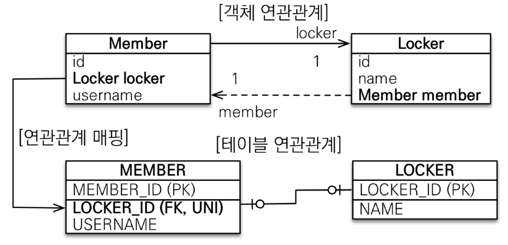
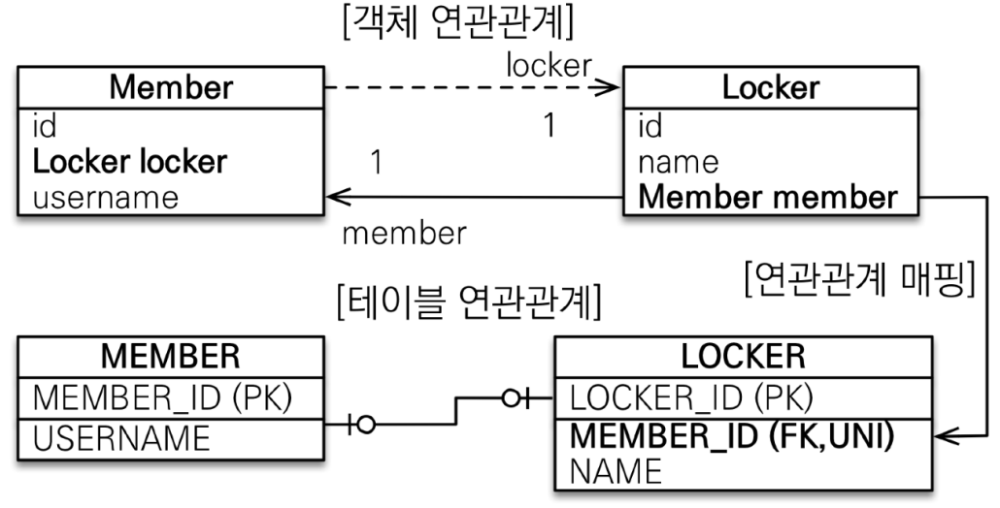
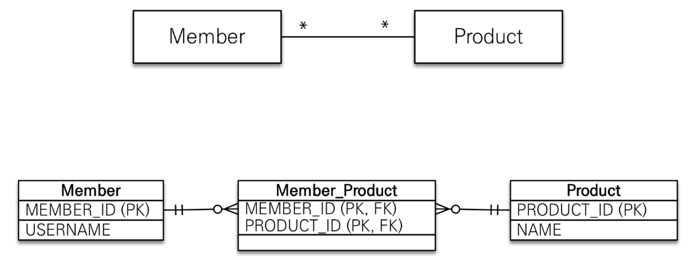
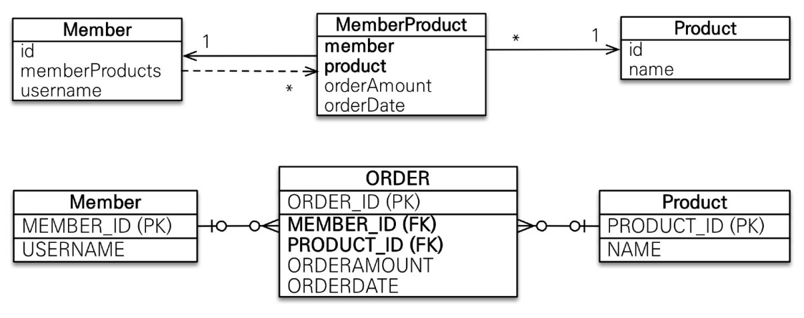

# 다양한 연관관계 매핑

## 연관관계 매핑 시 고려사항

- 다중성
  - 다대일 : `@ManyToOne`
  - 일대다 : `@OneToMany`
  - 일대일 : `@OneToOne`
  - 다대다 : `@ManyToMany`
- 단방향, 양방향
- 연관관계의 주인

## 다대일 | N:1

### 다대일 단방향

- ```java
  @Getter
  @Setter
  @Entity
  public class Member {

      @Id
      @GeneratedValue
      private Long id;

      @Column(name = "USERNAME")
      private String name;

      @ManyToOne
      @JoinColumn(name = "TEAM_ID")
      private Team team;

  }
  ```

- ```java
  @Getter
  @Setter
  @Entity
  public class Team {

      @Id
      @GeneratedValue
      @Column(name = "TEAM_ID")
      private Long id;

      private String name;

  }
  ```

### 다대일 양방향

- 외래 키가 있는 쪽이 연관관계의 주인.
- 양쪽을 서로 참조하도록 개발.

- ```java
  @Getter
  @Setter
  @Entity
  public class Member {

      @Id
      @GeneratedValue
      private Long id;

      @Column(name = "USERNAME")
      private String name;

      @ManyToOne
      @JoinColumn(name = "TEAM_ID")
      private Team team;

  }
  ```

- ```java
  @Getter
  @Setter
  @Entity
  public class Team {

      @Id
      @GeneratedValue
      @Column(name = "TEAM_ID")
      private Long id;

      private String name;

      @OneToMany(mappedBy = "team")
      private List<Member> members = new ArrayList<>();

  }
  ```

## 일대다 | 1:N

### 일대다 단방향

- 권장하지 않음. 다대일 양방향을 사용하자.
- 연관관계의 주인이 아닌 테이블에 외래 키가 있어, 추가적인 SQL이 발생한다.
- ```java
  @Getter
  @Setter
  @Entity
  public class Team {

      @Id
      @GeneratedValue
      @Column(name = "TEAM_ID")
      private Long id;

      private String name;

      @OneToMany
      @JoinColumn(name = "TEAM_ID")
      private List<Member> members = new ArrayList<>();

  }
  ```

- ```java
  @Getter
  @Setter
  @Entity
  public class Member {

      @Id
      @GeneratedValue
      private Long id;

      @Column(name = "USERNAME")
      private String name;

  }
  ```

### ~~일대다 양방향~~

- 권장하지 않음. 다대일 양방향을 사용하자.
- 두 엔티티 모두 연관관계의 주인으로 만들고, 한 엔티티를 읽기 전용으로 만드는 방법

- ```java
  @Getter
  @Setter
  @Entity
  public class Team {

      @Id
      @GeneratedValue
      @Column(name = "TEAM_ID")
      private Long id;

      private String name;

      @OneToMany
      @JoinColumn(name = "TEAM_ID")
      private List<Member> members = new ArrayList<>();

  }
  ```

- ```java
  @Getter
  @Setter
  @Entity
  public class Member {

      @Id
      @GeneratedValue
      private Long id;

      @Column(name = "USERNAME")
      private String name;

      @ManyToOne
      @JoinColumn(name = "TEAM_ID", insertable = false, updateable = false)
      private Team team;

  }
  ```

## 일대일 | 1:1

- 사용 방법은 다대일 양방향 매핑과 동일하다. `@ManyToOne`/`@OneToMany`를 `@OneToOne`으로 수정하면 된다.
- 외래 키가 있는 테이블이 반드시 연관관계의 주인이 되어야 한다. 외래 키가 없는 테이블이 주인이 되는 케이스는 JPA에서 지원하지 않는다.

- ```java
  @Getter
  @Setter
  @Entity
  public class Member {

      @Id
      @GeneratedValue
      private Long id;

      @Column(name = "USERNAME")
      private String name;

      @ManyToOne
      @JoinColumn(name = "TEAM_ID")
      private Team team;

      @OneToOne
      @JoinColumn(name = "LOCKER_ID")
      private Locker locker;

  }
  ```

- ```java
  @Getter
  @Setter
  @Entity
  public class Locker {

      @Id
      @GeneratedValue
      @Column(name = "LOCKER_ID")
      private Long id;

      private String name;

      @OneToOne(mappedBy = "locker")
      private Member member;

  }
  ```

- 일대일 특성 상, 주 테이블에 외래 키를 둘 수 있고, 대상 테이블에 외래 키를 둘 수 있다. 어디에 두느냐에 따라 trade-off가 존재한다.
  - 주 테이블에 외래키를 둔 케이스
    - 
    - JPA 매핑이 편리하여, 객체지향 개발자가 선호한다.
    - 장점 : 주 테이블만 조회해도 대상 테이블에 데이터가 있는지 확인 가능하다.
    - 단점 : 값이 없을 수 있어, 외래 키에 null을 허용해야 한다.
  - 대상 테이블에 외래키를 둔 케이스
    - 
    - 장점 : 주 테이블과 대상 테이블을 일대일에서 일대다 관계로 변경할 때 쉽다.
    - 단점 : JPA 프록시 기능의 한계로 지연 로딩으로 설정해도 항상 즉시 로딩된다.

## ~~다대다 | N:N~~

- 결론부터 말하면, 실무에서 사용하면 안된다.
- 테이블은 두 테이블 사이에 연결 테이블을 두어 다대다 관계를 표현이 가능한 반면, 객체는 연결 객체를 두지 않고 다대다 관계를 표현 가능하다.
  - 
- `@ManyToMany`와 `@JoinTable`을 사용하여, DB에 연결 테이블을 자동으로 만들어줄 수 있다.

  - ```java
    @Getter
    @Setter
    @Entity
    public class Member {

        @Id
        @GeneratedValue
        private Long id;

        @ManyToMany
        @JoinTable(name = "MEMBER_PRODUCT") // 연결 테이블 명을 작성한다.
        private List<Product> products = new ArrayList<>();

    }
    ```

  - ```java
    @Getter
    @Setter
    @Entity
    public class Product {

        @Id
        @GeneratedValue
        @Column(name = "PRODUCT_ID")
        private Long id;

        private String name;

        @ManyToMany(mappedBy = "products")
        private List<Member> members = new ArrayList<>();

    }
    ```

  - ```
    # JPA가 생성한 create 쿼리
    Hibernate:

        create table Member (
          id bigint not null,
            primary key (id)
        )
    Hibernate:

        create table MEMBER_PRODUCT (
          members_id bigint not null,
            products_PRODUCT_ID bigint not null
        )
    Hibernate:

        create table Product (
          PRODUCT_ID bigint not null,
            name varchar(255),
            primary key (PRODUCT_ID)
        )
    ```

- `@ManyToMany`와 `@JoinTable`의 한계 : 연결 테이블에 추가 컬럼을 두고 싶은 경우, `@JoinTable`로 이를 구현할 수 없다.
- 극복 : 연결 테이블을 위한 엔티티를 새로 만들고, 연결 엔티티와 다대일/일대다 관계를 만들자.

  - 

  - ```java
    @Getter
    @Setter
    @Entity
    public class Member {

        @Id
        @GeneratedValue
        private Long id;

        @OneToMany(mappedBy = "member")
        private List<MemberProduct> memberProducts = new ArrayList<>();

    }
    ```

  - ```java
    @Getter
    @Setter
    @Entity
    public class Product {

        @Id
        @GeneratedValue
        @Column(name = "PRODUCT_ID")
        private Long id;

        private String name;

        @OneToMany(mappedBy = "product")
        private List<MemberProduct> memberProducts = new ArrayList<>();

    }
    ```

  - ```java
    @Getter
    @Setter
    @Entity
    public class MemberProduct {

        @Id
        @GeneratedValue
        @Column(name = "MEMBER_PRODUCT_ID")
        private Long id;

        @ManyToOne
        @JoinColumn(name = "MEMBER_ID")
        private Member member;

        @ManyToOne
        @JoinColumn(name = "PRODUCT_ID")
        private Product product;

        private int count;

        private int price;

    }
    ```

## 애노테이션 정리

### `@JoinColumn`

| option                                                           | description                                                                           | default                                        |
| ---------------------------------------------------------------- | ------------------------------------------------------------------------------------- | ---------------------------------------------- |
| name                                                             | 매핑할 외래 키 이름                                                                   | 필드명 + \_ + 참조하는 테이블의 기본 키 컬럼명 |
| referencedColumnName                                             | 외래 키가 참조하는 대상 테이블의 컬럼명                                               | 참조하는 테이블의 기본 키 컬럼명               |
| foreignKey (DDL)                                                 | 외래 키 제약조건을 직접 지정할 수 있다. <br> 이 속성은 테이블을 생성할 때만 사용한다. |                                                |
| unique, nullable, insertable, updatable, columnDefinition, table | @Column의 속성과 동일                                                                 |                                                |

### `@ManyToOne`

| option   | description                                        | default         |
| -------- | -------------------------------------------------- | --------------- |
| optional | false로 설정하면 연관된 엔티티가 항상 있어야 한다. | TRUE            |
| fetch    | 글로벌 페치 전략을 설정한다.                       | FetchType.EAGER |
| cascade  | 영속성 전이 기능을 사용한다.                       |                 |

### `@OneToMany`

| option   | description                      | default        |
| -------- | -------------------------------- | -------------- |
| mappedBy | 연관관계의 주인 필드를 선택한다. |                |
| fetch    | 글로벌 페치 전략을 설정한다.     | FetchType.LAZY |
| cascade  | 영속성 전이 기능을 사용한다.     |                |
