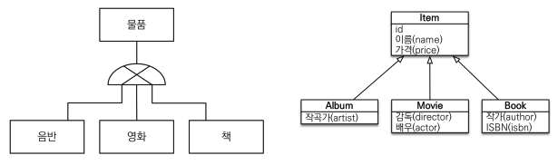

# 고급 매핑

## 상속관계 매핑



- 관계형 데이터베이스에서 객체지향의 상속 관계와 유사한 것은 슈퍼타입-서브타입 관계다. 슈퍼타입-서브타입 논리 모델을 실제 물리 모델로 표현하기 위한 전략으로 **조인 전략**, **단일 테이블 전략**, **구현 클래스마다 테이블 전략**이 있다.

### 단일 테이블 전략


- 부모 테이블의 컬럼과 자식 테이블의 컬럼 모두 하나의 통합된 테이블로 구성한다.
- `@Inheritance(strategy = InheritanceType.{})` 의 기본값
- 단일 테이블 전략은 자식 클래스의 타입을 구분할 수 있는 컬럼인 `DTYPE`이 자동으로 들어간다. (다른 전략은 부모 클래스에 `@DiscriminatorColumn` 애노테이션을 붙여야 한다.)
- 타입 별 구분 컬럼인 `DTYPE`을 다른 이름으로 바꾸려면, `@DiscriminatorColumn("XXX")` 라고 입력하면 된다.
- 타입 별 구분 컬럼에 자식 클래스의 값은 모두 클래스 이름으로 저장되는데, 이를 바꾸려면 자식 클래스에 `@DiscriminatorValue("YYY")` 애노테이션을 입력하면 된다.

```java
@Getter
@Setter
@Entity
@Inheritance(strategy = InheritanceType.SINGLE_TABLE)
@DiscriminatorColumn // SINGLE_TABLE에서 생략 가능
public abstract class Item extends BaseEntity {

    @Id
    @GeneratedValue
    private Long Id;

    private String name;
    private int price;

}
```

```java
@Getter
@Setter
@Entity
@DiscriminatorValue("ALBUM")
public class Album extends Item {

    private String artist;

}
```

```java
@Getter
@Setter
@Entity
@DiscriminatorValue("BOOK")
public class Book extends Item {

    private String author;
    private String isbn;

}
```

```java
@Getter
@Setter
@Entity
@DiscriminatorValue("MOVIE")
public class Movie extends Item {

    private String director;
    private String actor;

}
```

```
Hibernate:

    create table Item (
       DTYPE varchar(31) not null,
        Id bigint not null,
        createdBy varchar(255),
        createdDate timestamp,
        lastModifiedBy varchar(255),
        lastModifiedDate timestamp,
        name varchar(255),
        price integer not null,
        artist varchar(255),
        actor varchar(255),
        director varchar(255),
        author varchar(255),
        isbn varchar(255),
        primary key (Id)
    )
```

### 조인 전략


- 유사한 컬럼을 묶은 부모 테이블을 두고, 부모 테이블의 PK를 PK, FK로 지정한 자식 테이블들을 각각 생성한다.

```java
@Getter
@Setter
@Entity
@Inheritance(strategy = InheritanceType.JOINED)
@DiscriminatorColumn
public abstract class Item extends BaseEntity {

    @Id
    @GeneratedValue
    private Long Id;

    private String name;
    private int price;

}
```

```java
@Getter
@Setter
@Entity
@DiscriminatorValue("ALBUM")
public class Album extends Item {

    private String artist;

}
```

```java
@Getter
@Setter
@Entity
@DiscriminatorValue("BOOK")
public class Book extends Item {

    private String author;
    private String isbn;

}
```

```java
@Getter
@Setter
@Entity
@DiscriminatorValue("MOVIE")
public class Movie extends Item {

    private String director;
    private String actor;

}
```

```
Hibernate:

    create table Item (
       DTYPE varchar(31) not null,
        Id bigint not null,
        createdBy varchar(255),
        createdDate timestamp,
        lastModifiedBy varchar(255),
        lastModifiedDate timestamp,
        name varchar(255),
        price integer not null,
        primary key (Id)
    )
Hibernate:

    create table Movie (
       actor varchar(255),
        director varchar(255),
        Id bigint not null,
        primary key (Id)
    )
Hibernate:

    create table Album (
       artist varchar(255),
        Id bigint not null,
        primary key (Id)
    )
Hibernate:

    create table Book (
       author varchar(255),
        isbn varchar(255),
        Id bigint not null,
        primary key (Id)
    )
```

### 구현 클래스마다 테이블 전략


- 자식 테이블 각각의 테이블만 생성한다.

```java
@Getter
@Setter
@Entity
@Inheritance(strategy = InheritanceType.TABLE_PER_CLASS)
public abstract class Item extends BaseEntity {

    @Id
    @GeneratedValue
    private Long Id;

    private String name;
    private int price;

}
```

```java
@Getter
@Setter
@Entity
public class Album extends Item {

    private String artist;

}
```

```java
@Getter
@Setter
@Entity
public class Book extends Item {

    private String author;
    private String isbn;

}
```

```java
@Getter
@Setter
@Entity
public class Movie extends Item {

    private String director;
    private String actor;

}
```

```
Hibernate:

    create table Album (
       Id bigint not null,
        createdBy varchar(255),
        createdDate timestamp,
        lastModifiedBy varchar(255),
        lastModifiedDate timestamp,
        name varchar(255),
        price integer not null,
        artist varchar(255),
        primary key (Id)
    )
Hibernate:

    create table Book (
       Id bigint not null,
        createdBy varchar(255),
        createdDate timestamp,
        lastModifiedBy varchar(255),
        lastModifiedDate timestamp,
        name varchar(255),
        price integer not null,
        author varchar(255),
        isbn varchar(255),
        primary key (Id)
    )
Hibernate:

    create table Movie (
       Id bigint not null,
        createdBy varchar(255),
        createdDate timestamp,
        lastModifiedBy varchar(255),
        lastModifiedDate timestamp,
        name varchar(255),
        price integer not null,
        actor varchar(255),
        director varchar(255),
        primary key (Id)
    )
```

### 결론

| InheritanceType     | 장점                                                                            | 단점                                                                                                                                            | 비고   |
| ------------------- | ------------------------------------------------------------------------------- | ----------------------------------------------------------------------------------------------------------------------------------------------- | ------ |
| SINGLE_TABLE        | 조인이 필요 없어 조회 성능이 빠름 <br> 조회 쿼리가 단순함                       | 자식 엔티티가 매핑한 컬럼은 모두 null 허용 <br> 단일 테이블에 모든 것을 저장하므로 테이블이 커질 수 있고, 이로 인해 조회 성능이 느려질 수 있다. | 기본값 |
| JOINED              | 테이블 정규화 <br> 외래 키 참조 무결성 제약 조건 활용 가능 <br> 저장공간 효율화 | 조회 시 조인을 많이 사용하여, 성능 저하 <br> 조회 쿼리가 복잡함 <br> 데이터 저장 시 insert 쿼리 두 번 호출                                      |        |
| ~~TABLE_PER_CLASS~~ | 서브타입을 명확하게 구분해서 처리할 때 효과적 <br> not null 제약조건 사용 가능  | 여러 자식 테이블을 함께 조회할 때 성능이 느림 <br> 자식 테이블을 통합해서 쿼리하기 어려움                                                       |        |

## `@MappedSuperClass`


- 상속 관계와 전혀 상관 없고, 부모 클래스를 상속 받는 자식 클래스에 매핑 정보만 제공한다.
- 테이블과 관계 없고, 단순히 엔티티가 공통으로 사용하는 매핑 정보를 모으는 역할
- 주로 등록일, 수정일, 등록자, 수정자 같은 전체 엔티티에서 공통으로 적용하는 정보를 모을 때 사용
- `@Entity` 클래스는 엔티티나 `@MappedSuperclass`로 지정한 클래스만 상속 가능

```java
@Getter
@Setter
@MappedSuperclass
public abstract class BaseEntity {

    private String createdBy;
    private LocalDateTime createdDate;
    private String lastModifiedBy;
    private LocalDateTime lastModifiedDate;

}
```

```java
@Getter
@Setter
@Entity
@Inheritance
public abstract class Item extends BaseEntity {

    @Id
    @GeneratedValue
    private Long Id;

    private String name;
    private int price;

}
```
