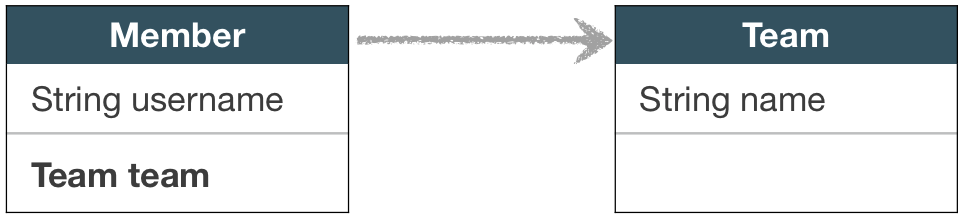
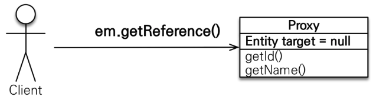
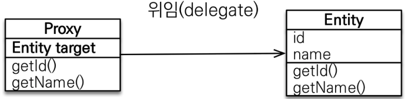
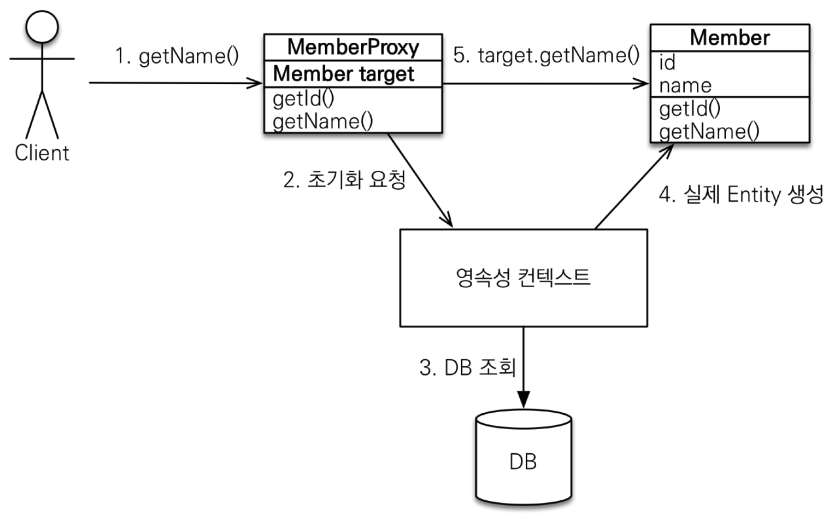
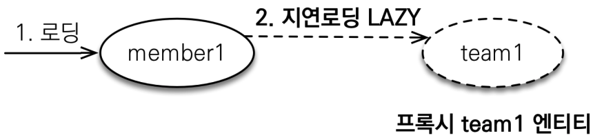
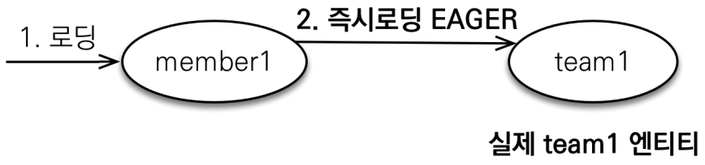

# 프록시와 연관관계 관리

- Member를 조회할 때 Team도 함께 조회해야 할까?
  - 
  - 비즈니스 로직에서, Member와 Team을 함께 조회하는 경우도 있을 수 있고, Member만 조회하는 경우도 있을 것이다.
  - 매번 테이블 조인을 걸어 Member와 Team를 가져올 수 있으나, 비즈니스 로직에서 쓰이지 않는다면 메모리 차지만 할 것이다.
  - Team 엔티티가 실제로 사용되기 전까지 DB에서 가져오지 않는 지연 로딩 기능 구현을 위해 하이버네이트는 프록시를 사용하는 방법을 제공한다.

## 프록시 객체

- `em.find()` vs `em.getReference()`

  - `em.find()` : 데이터베이스를 통해서 실제 엔티티 객체 반환
  - `em.getReference()` : 데이터베이스 조회를 미루는 가짜 프록시 엔티티 객체 반환
    - 

- 프록시 객체는 실제 엔티티를 상속 받아서 만들어진다. 프록시 객체는 실제 객체의 참조(target)를 보관한다.

  - 

- 프록시 객체 메서드를 호출하면 프록시 객체는 실제 객체의 메서드를 호출한다. 이를 프록시 객체 초기화라고 한다. 프록시 객체 초기화를 위해 영속성 컨텍스트로부터 DB 조회가 이루어지고, 실제 엔티티를 생성한다.

  - 

- 프록시의 특징

  - 프록시 객체는 처음 사용할 때 한 번만 초기화한다.
  - 프록시 객체가 초기화되었다고 해서, 프록시 객체가 실제 엔티티로 바뀌지 않는다. 프록시 객체를 실제 엔티티처럼 사용할 수 있다.
  - 프록시 객체는 원본 엔티티를 상속 받아서 만들어진다. 프록시 객체와 원본 엔티티의 타입 비교 시 `==` 비교가 불가할 수 있다. 대신 `instanceof`를 사용하자.
  - `em.getReference()` 로 가져올 엔티티가 영속성 컨텍스트에 이미 존재한다면, `em.getReference()`는 프록시가 아닌 실제 엔티티를 반환한다.
  - 실제 엔티티가 준영속 상태인 프록시 객체를 초기화하면, `LazyInitializationException` 예외가 발생한다.

- 프록시 관련 메서드
  - 프록시 인스턴스의 초기화 여부 확인
    - ```java
      PersistenceUnitUtil persistenceUnitUtil = emf.getPersistenceUnitUtil();
      boolean isLoaded = persistenceUnitUtil.isLoaded(Object proxyEntity);
      ```
  - 프록시 클래스 확인 방법
    - ```java
      entity.getClass().getName()
      ```
  - 프록시 강제 초기화
    - 하이버네이트에서 제공하는 방식
      - ```java
        org.hibernate.Hibernate.initialize(entity);
        ```
    - JPA에서는 제공하지는 않지만, 프록시 객체의 메서드를 강제로 호출하기

## 즉시 로딩과 지연 로딩

- Member와 Team의 관계는 N:1이다. Member 엔티티 내부에 Team이 `@ManyToOne`으로 연관관계 매핑이 되어있다면, Member를 데이터베이스에서 조회할 때 늘 Team을 가져와야 할까?
  - 비즈니스 로직 상 Member를 사용할 때마다 Team을 사용한다면? >> 즉시 로딩이 유리할 수 있다.
  - 비즈니스 로직 상 Member를 사용할 때 가끔 Team을 사용한다면? >> 지연 로딩이 유리할 수 있다.

### 지연 로딩

- 한 엔티티 내부에 다른 엔티티가 연관관계 매핑이 되어 있을 때, 한 엔티티를 DB 조회할 때 다른 엔티티를 프록시 객체로 가져왔다가, 프록시 객체 내 메서드를 실행할 때 DB 조회가 실행되는 기법이 지연 로딩이다.

- 

  - ```java
    @Entity
    public class Member {
        @Id
        @GeneratedValue
        private Long id;

        private String name;

        @ManyToOne(fetch = FetchType.LAZY) // 지연 로딩
        @JoinColumn(name = "TEAM_ID")
        private Team team;
    }
    ```

  - ```java
    // main 함수

    // Member는 실제 엔티티로, DB에 쿼리 수행됨.
    Member member = em.find(Member.class, 1L);

    // Team은 프록시 객체로, 아직 초기화되지 않은 상태
    Team team = member.getTeam();

    // 프록시 객체 메서드 실행될 때 프록시 객체 초기화, DB에 쿼리 수행됨.
    team.getName();
    ```

### 즉시 로딩

- 한 엔티티 내부에 다른 엔티티가 연관관계 매핑이 되어 있을 때, 한 엔티티를 DB 조회할 때 다른 엔티티 또한 조인 쿼리를 통해 가져오는 기법이 즉시 로딩이다.

- 

  - ```java
    @Entity
    public class Member {
        @Id
        @GeneratedValue
        private Long id;

        private String name;

        @ManyToOne(fetch = FetchType.EAGER) // 즉시 로딩
        @JoinColumn(name = "TEAM_ID")
        private Team team;
    }
    ```

  - ```java
    // main 함수

    // Member는 실제 엔티티고, Team은 즉시 로딩이므로, DB에 member와 team이 조인된 쿼리 수행됨.
    Member member = em.find(Member.class, 1L);

    // Team은 실제 엔티티
    Team team = member.getTeam();
    ```

### 지연 로딩 vs 즉시 로딩

- 가급적 지연 로딩만 사용해야 한다.
  - 즉시 로딩을 적용하면 예상치 못한 SQL이 발생하게 된다.
  - 즉시 로딩은 JPQL에서 N+1 문제를 야기한다.
- `@ManyToOne`, `@OneToOne`은 기본이 즉시 로딩 -> LAZY로 설정
- `@OneToMany`, `@ManyToMany`는 기본이 지연 로딩

## 영속성 전이 : CASCADE

- 특정 엔티티를 영속 상태로 만들 때 연관된 엔티티도 함께 영속 상태로 만들고 싶을 때 사용한다. 자식 엔티티가 다른 엔티티와 관련이 없고, 오직 부모 엔티티와 관련이 있을 때 유용하다.
- 예시 : 부모 엔티티를 저장할 때 자식 엔티티도 함께 저장하는 경우

  - ```java
    @Entity
    public class Parent {
        @Id
        @GeneratedValue
        private Long id;

        private String name;

        @OneToMany(mappedBy = "parent", cascade = CascadeType.ALL)
        private List<Child> children = new ArrayList<>();

        public void addChild(Child child) {
            children.add(child);
            child.setParent(this);
        }
    }
    ```

  - ```java
    @Entity
    public class Child {
        @Id
        @GeneratedValue
        private Long id;

        private String name;

        @ManyToOne
        @JoinColumn(name = "PARENT_ID")
        private Parent parent;
    }
    ```

  - ```java
    // main 함수

    Child child1 = new Child();
    Child child2 = new Child();

    Parent parent = new Parent();
    parent.addChild(child1);
    parent.addChild(child2);

    // 이 때, parent, child1, child2 모두 영속성 컨텍스트에 저장된다.
    em.persist(parent);
    ```

- CASCADE는 연관관계 매핑과 관련이 없고, 엔티티를 영속화할 때 연관된 엔티티도 함께 영속화하는 편리함을 제공하는 역할만 한다.
- CASCADE 종류
  - ALL : 모두 적용
  - PERSIST : 영속
  - REMOVE : 삭제
  - MERGE : 병합
  - REFRESH
  - DETACH

## 고아 객체

- 부모 엔티티와 연관관계가 끊어진 자식 엔티티를 자동으로 삭제. 자식 엔티티가 다른 엔티티와 관련이 없고, 오직 부모 엔티티와 관련이 있을 때 유용하다.
- `@OneToOne`, `@OneToMany`만 가능
- 예시

  - ```java
    @Entity
    public class Parent {
        @Id
        @GeneratedValue
        private Long id;

        private String name;

        @OneToMany(mappedBy = "parent", cascade = CascadeType.ALL, orphanRemoval = true)
        private List<Child> children = new ArrayList<>();

        public void addChild(Child child) {
            children.add(child);
            child.setParent(this);
        }
    }
    ```

  - ```java
    @Entity
    public class Child {
        @Id
        @GeneratedValue
        private Long id;

        private String name;

        @ManyToOne
        @JoinColumn(name = "PARENT_ID")
        private Parent parent;
    }
    ```

  - ```java
    // main 함수

    Child child1 = new Child();
    Child child2 = new Child();

    Parent parent = new Parent();
    parent.addChild(child1);
    parent.addChild(child2);

    em.persist(parent);
    em.flush();
    em.clear();

    Parent findParent = em.find(Parent.class, parent.getId());
    findParent.getChildren().remove(0); // 0번째 자식 엔티티 삭제됨

    em.persist(findParent);
    ```
