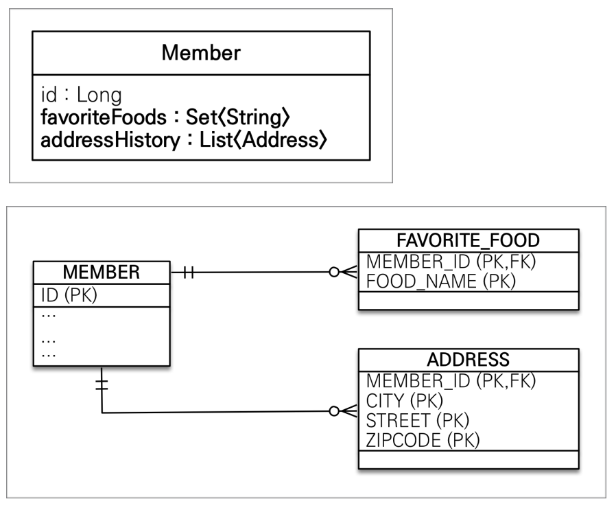
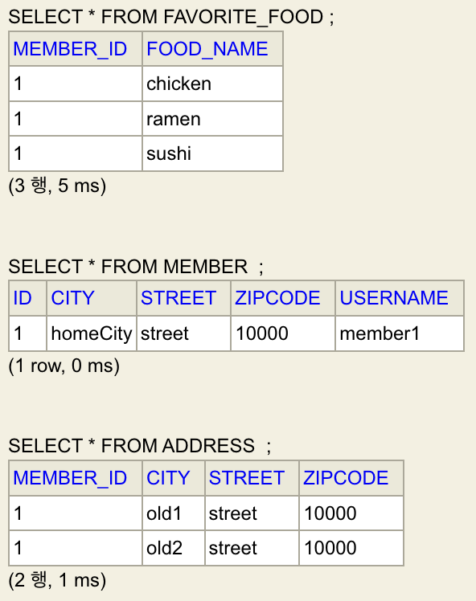

# 값 타입 (Value Type)

- JPA의 데이터 타입 분류
  - 

## 엔티티 타입

- `@Entity`로 정의하는 객체
- 데이터가 변해도 (영속성 컨텍스트의) 식별자로 지속해서 추적 가능하다.
  - 예를 들어, 회원 엔티티의 키나 나이 값을 변경해도 식별자로 인식 가능하다.

## 값 타입

- int, Integer, String 처럼 단순히 값으로 사용하는 자바 기본타입이나 객체
- 식별자가 없고 값만 있으므로, 변경되어도 추적이 불가능하다.
  - 예를 들어, 숫자 100을 200으로 변경하면 완전히 다른 값으로 대체되고, 추적이 불가능하다.

### 기본값 타입

- 자바 기본 타입인 int, double, 래퍼 클래스인 Integer, Long, 그리고 String 등이 속한다.
- 기본값 타입 생명주기는 이 필드가 속한 엔티티에 의존한다.
- 값 타입은 공유하면 안된다.

> 참고로, 자바의 기본 타입은 절대 공유되지 않는다.
>
> - int, double같은 자바 기본 타입은 절대 공유되지 않는다.
> - 기본 타입은 항상 값을 복사한다.
>
> 래퍼 클래스는 공유 가능한 객체지만 불변 객체로, JPA의 값 타입이 공유되지 않는 점에 부합한다.

### 임베디드 타입

- 새로운 값 타입을 직접 정의할 수 있음.
- 주로 기본 값 타입 여러 개를 묶어 임베디드 타입으로 만들고, 이런 특성 때문에 복합 값 타입이라고도 한다.
- 기본값 타입 생명주기처럼, 임베디드 타입을 소유한 엔티티의 생명주기에 의존한다.
- 임베디드 타입 클래스에 유용한 메서드를 추가할 수 있다. >> 응집도 증가
- 예시

  - `startDate`, `endDate`를 하나로 묶어 `Period`라는 임베디드 타입을 만들 수 있다.
  - `city`, `street`, `zipcode`를 하나로 묶어 `Address`라는 임베디드 타입을 만들 수 있다.
  - 
  - ```java
    @Getter
    @Setter
    @Entity
    public class Member {
        @Id
        @GeneratedValue
        private Long id;

        @Column(name = "USERNAME")
        private String name;

        @Embedded
        private Period workPeriod;

        @Embedded
        private Address homeAddress;

        @Embedded
        @AttributeOverrides({
            @AttributeOverride(name = "city", column = @Column(name = "WORK_CITY")),
            @AttributeOverride(name = "street", column = @Column(name = "WORK_STREET")),
            @AttributeOverride(name = "zipcode", column = @Column(name = "WORK_ZIPCODE"))
        })
        private Address workAddress;

    }
    ```

  - ```java
    @Getter
    @Setter
    @Embeddable
    public class Period {
        private LocalDateTime startDate;
        private LocalDateTime endDate;
    }
    ```

  - ```java
    @Getter
    @Setter
    @Embeddable
    public class Address {
        private String city;
        private String street;
        private String zipcode;
    }
    ```

- 임베디드 타입 사용법

  - `@Embeddable` : 값 타입을 정의하는 곳에 표시
  - `@Embedded` : 값 타입을 사용하는 곳에 표시
  - `@AttributeOverrides`, `@AttributeOverride` : 한 엔티티에서 같은 임베디드 타입을 사용할 경우, 컬럼 명이 중복될 수 있다. 위 애노테이션을 사용해 컬럼명을 재정의할 수 있다.

- 임베디드 타입 사용 시 테이블 매핑
  - 
  - 임베디드 타입은 엔티티의 값일 뿐, 임베디드 타입 사용 전후 테이블의 변화는 없다.
- 임베디드 타입을 사용한 엔티티에서 임베디드 타입 값이 null이면, 매핑된 모든 컬럼의 값은 null로 들어간다.

## 값 타입은 불변 객체로 만들어야 한다.

- 임베디드 타입과 같이 객체인 값 타입은 공유될 수 있는 위험이 있다.

  - 객체와 기본 타입의 차이
    - 자바의 기본 타입의 경우
      - ```java
        int a = 10;
        int b = a; // 10이라는 값을 복사해서 b에 넣어준다.
        b = 4;
        // a = 10, b = 4
        ```
    - 자바의 객체 타입의 경우
      - ```java
        Address a = new Address("Old");
        Address b = a; // city = "Old"인 인스턴스의 참조를 전달한다.
        b.setCity("New");
        // a.city = "New", b.city = "New"
        ```
  - 위험이 발생하는 경우 예시

    - ```java
      Address address = new Address("Old");
      Member member1 = new Member(address);
      Member member2 = new Member(address);
      em.persist(member1);
      em.persist(member2);

      // ...

      member1.getAddress().setCity("New");
      em.persist(member1);
      // member1의 address는 member2와 공유하고 있어, member1, member2의 address.city가 변경된다.
      ```

- 객체인 값 타입을 수정할 수 없게, setter를 없애거나 private로 선언하여 불변 객체로 만들어야 한다.
  - ```java
    @Getter
    @Setter(value = AccessLevel.PRIVATE)
    @Embeddable
    public class Period {
        private LocalDateTime startDate;
        private LocalDateTime endDate;
    }
    ```

## 값 타입 비교

- 값 타입의 경우 인스턴스가 달라도 그 안에 값들이 같으면 같은 것으로 봐야 한다.
- 객체끼리의 동등 비교 `==`는 인스턴스의 참조 값을 비교하므로, 우리가 원하는 값 타입 비교의 결과에 맞지 않다. 따라서, Object의 `equals()`를 오버라이드하여 동등성 비교를 해야 한다.

```java
@Getter
@Setter(value = AccessLevel.PRIVATE)
@Embeddable
public class Address {

    private String city;
    private String street;
    private String zipcode;

    @Override
    public boolean equals(Object o) {
        if (this == o) {
            return true;
        }
        if (o == null || getClass() != o.getClass()) {
            return false;
        }
        Address address = (Address) o;
        return Objects.equals(city, address.city) && Objects.equals(street, address.street)
            && Objects.equals(zipcode, address.zipcode);
    }

    @Override
    public int hashCode() {
        return Objects.hash(city, street, zipcode);
    }
}
```

## 값 타입 컬렉션

- 일대다 관계가 아닌, 값 타입의 컬렉션(List, Set, ...)을 한 엔티티 안에서 관리하는 케이스다.
- 데이터베이스는 한 행에 여러 값을 가지지 못하므로, 컬렉션을 위한 별도의 테이블을 만들어주어야 한다.

- 

```java
@Getter
@Setter
@Entity
public class Member {
    @Id
    @GeneratedValue
    private Long id;

    @Column(name = "USERNAME")
    private String name;

    @Embedded
    private Address homeAddress;

    @ElementCollection
    @CollectionTable(name = "FAVORITE_FOOD", joinColumns = @JoinColumn(name = "MEMBER_ID"))
    @Column(name = "FOOD_NAME")
    private Set<String> favoriteFoods = new HashSet<>();

    @ElementCollection
    @CollectionTable(name = "ADDRESS", joinColumns = @JoinColumn(name = "MEMBER_ID"))
    private List<Address> addressHistory = new ArrayList<>();
}
```

```java
@Getter
@Setter(value = AccessLevel.PRIVATE)
@Embeddable
public class Address {

    private String city;
    private String street;
    private String zipcode;

    @Override
    public boolean equals(Object o) {
        if (this == o) {
            return true;
        }
        if (o == null || getClass() != o.getClass()) {
            return false;
        }
        Address address = (Address) o;
        return Objects.equals(city, address.city) && Objects.equals(street, address.street)
            && Objects.equals(zipcode, address.zipcode);
    }

    @Override
    public int hashCode() {
        return Objects.hash(city, street, zipcode);
    }
}
```

```java
// main 함수

// 기본 데이터 저장
Member member = new Member();
member.setName("member1");
member.setHomeAddress(new Address("homeCity", "street", "10000"));

member.getFavoriteFoods().add("chicken");
member.getFavoriteFoods().add("sushi");
member.getFavoriteFoods().add("ramen");

member.getAddressHistory().add(new Address("old1", "street", "10000"));
member.getAddressHistory().add(new Address("old2", "street", "10000"));

em.persist(member);

em.flush();
em.clear();

// ... DB 쿼리 수행 사진 이후 main 함수 이어짐 ...
```



```java
// 값 타입 데이터 조회하기
Member findMember = em.find(Member.class, member.getId());

// 값 타입 컬렉션은 기본적으로 지연 로딩 전략이 들어가 있어, 메서드 호출 직전까지 DB에서 가져오지 않는다.

List<Address> addressHistory = findMember.getAddressHistory();
for (Address address : addressHistory) {
    System.out.println("address.getCity() = " + address.getCity());
}

Set<String> favoriteFoods = findMember.getFavoriteFoods();
for (String favoriteFood : favoriteFoods) {
    System.out.println("favoriteFood = " + favoriteFood);
}

// 값 타입 수정
Address oldAddress = findMember.getHomeAddress();
findMember.setHomeAddress(
    new Address("newCity", oldAddress.getStreet(), oldAddress.getZipcode()));

// 값 타입 컬렉션 수정
findMember.getFavoriteFoods().remove("chicken");
findMember.getFavoriteFoods().add("pizza");

// 임베디드 타입 컬렉션 수정
findMember.getAddressHistory().remove(new Address("old1", "street", "10000"));
findMember.getAddressHistory().add(new Address("newCity1", "street", "10000"));
```

- 값 타입 컬렉션의 한계

  - 값 타입 컬렉션이 변경되면, 식별자가 없어 추적이 어렵다.
  - 값 타입 컬렉션이 변경되면, 주인 엔티티와 연관된 모든 데이터를 DELETE하고, 값 타입 컬렉션에 있는 현재 값을 모두 INSERT한다.

- 값 타입 컬렉션의 극복

  - 값 타입 컬렉션을 매핑하는 테이블은 모든 컬럼을 묶어서 기본키로 구성해야 한다.
  - 값 타입 컬렉션이 아닌, 일대다 관계를 고려해야 한다.

    - 영속성 전이 + 고아 객체 제거 옵션을 사용하면 값 타입 컬렉션처럼 사용 가능하다.

    - ```java
      @Getter
      @Setter
      @Entity
      public class Member {
          @Id
          @GeneratedValue
          private Long id;

          @Column(name = "USERNAME")
          private String name;

          @Embedded
          private Address homeAddress;

          @ElementCollection
          @CollectionTable(name = "FAVORITE_FOOD", joinColumns = @JoinColumn(name = "MEMBER_ID"))
          @Column(name = "FOOD_NAME")
          private Set<String> favoriteFoods = new HashSet<>();

          @OneToMany(cascade = CascadeType.ALL, orphanRemoval = true)
          @JoinColumn(name = "MEMBER_ID")
          private List<AddressEntity> addressHistory = new ArrayList<>();
      }
      ```

    - ```java
      @Getter
      @Setter
      @NoArgsConstructor
      @Entity
      @Table(name = "ADDRESS")
      public class AddressEntity {

          public AddressEntity(Address address) {
              this.address = address;
          }

          @Id
          @GeneratedValue
          private Long id;

          private Address address;

      }
      ```

## 결론

- 값 타입은 정말 값 타입이라 판단될 때만 사용하자.
- 엔티티와 값 타입을 혼동해서 엔티티를 값 타입으로 만들면 안된다.
- 식별자가 필요하거나, 지속해서 값을 추적해야 한다면 엔티티를 채택해야 한다.
