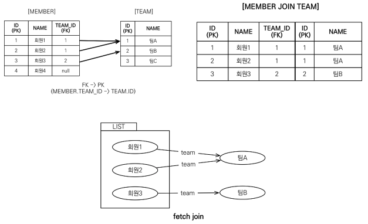
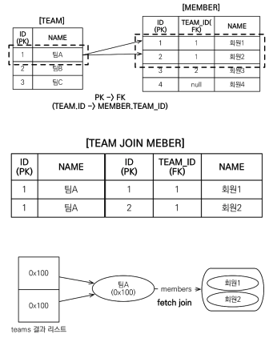
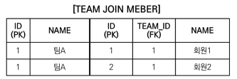
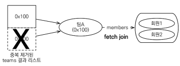
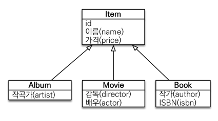

# JPQL (Java Persistence Query Language)

- JPQL은 엔티티 객체를 대상으로 쿼리하는 객체지향 쿼리 언어다.
- JPQL은 SQL을 추상화하여 특정 데이터베이스의 SQL에 의존하지 않는다.
- JPQL은 결국 SQL로 변환된다.
- JPQL 수행 후 자동으로 영속성 컨텍스트 플러시가 호출된다.

## 기본 문법

- JPQL 문법

```
select_문 :: =
  select_절
  from_절
  [where_절]
  [groupby_절]
  [having_절]
  [orderby_절]
update_문 :: = update_절 [where_절]
delete_문 :: = delete_절 [where_절]
```

- `select m from Member as m where m.age > 18`

  - JPQL 키워드는 대소문자 구분 X (select, from, as, where)
  - 엔티티와 엔티티의 속성은 대소문자 구분 O (Member, age)
    - 엔티티는 테이블 이름과 다르다.
    - 엔티티의 별칭은 필수다. (as는 생략 가능)

- 집합과 정렬
  - `COUNT(m)`, `SUM(m.age)`, `AVG(m.age)`, `MAX(m.age)`, `MIN(m.age)`
  - `GROUP BY`, `HAVING`
  - `ORDER BY`

## 쿼리 API

- 엔티티 매니저의 메서드 `createQuery`를 통해 `JPQL`을 `Query` 객체로 만들 수 있다.

  - `TypeQuery` : 반환 타입이 명확할 때 사용
    - ```java
      TypedQuery<Member> query =
          em.createQuery("SELECT m FROM Member m", Member.class);
      ```
  - `Query` : 반환 타입이 명확하지 않을 때 사용
    - ```java
      Query query =
          em.createQuery("SELECT m.username, m.age FROM Member m");
      ```

- 만들어진 `Query` 객체에는 결과 조회 API가 있다.
  - `query.getResultList()`
    - 결과가 하나 이상일 때, 리스트를 반환한다.
    - 결과가 없으면, 빈 리스트를 반환한다.
  - `query.getSingleResult()`
    - 결과가 정확히 단 하나여야 한다. 이때, 단일 객체를 반환한다.
    - 결과가 없거나 둘 이상일 때, Exception 발생

```java
List<Member> resultList = em.createQuery("select m from Member m", Member.class)
    .getResultList();
```

- 파라미터 바인딩

  - 이름 기준

    - ```java
      String sql = "SELECT m FROM Member m WHERE m.username = :username";

       // ...

      query.setParameter("username", "glory");
      ```

  - 위치 기준

    - ```java
      String sql = "SELECT m FROM Member m WHERE m.username = ?1";

      // ...

      query.setParameter(1, "glory");
      ```

## 프로젝션

- 프로젝션 : SELECT 절에 조회할 대상을 지정하는 것
- 프로젝션 대상 : 엔티티, 임베디드 타입, 스칼라 타입

  - `SELECT m FROM Member m` -> 엔티티 프로젝션
  - `SELECT m.team FROM Member m` -> 엔티티 프로젝션
  - `SELECT m.address FROM Member m` -> 임베디드 타입 프로젝션
  - `SELECT m.username, m.age FROM Member m` -> 스칼라 타입 프로젝션

- 여러 개의 스칼라 타입을 프로젝션 하는 방법

  - `SELECT m.username, m.age FROM Member m`

  1. Query 타입으로 조회

  ```java
  Query query = em.createQuery("SELECT m.username, m.age FROM Member m");
  List resultList = query.getResultList();

  Iterator iterator = resultList.iterator();
  while (iterator.hasNext()) {
      Object[] row = (Object[]) iterator.next();
      String username = (String) row[0];
      Integer age = (Integer) row[1];
  }
  ```

  2. Object[] 타입으로 조회

  ```java
  List<Object[]> resultList =
      em.createQuery("SELECT m.username, m.age FROM Member m").getResuiltList();

  for (Object[] row : resultList) {
      String username = (String) row[0];
      Integer age = (Integer) row[1];
  }
  ```

  3. new 명령어로 조회

  ```java
  // 새 DTO 클래스를 만들어준다.
  // 패키지 명을 포함한 전체 클래스 명을 입력해야 하고, 순서와 타입이 일치하는 생성자를 만들어야 한다.
  List<MemberDTO> resultListWithDTO = em.createQuery(
        "select new jpql.MemberDTO(m.username, m.age) from Member m", MemberDTO.class)
    .getResultList();

  for (MemberDTO member : resultListWithDTO) {
      String username = member.getUsername();
      Integer age = member.getAge();
  }
  ```

## 페이징 API

- `setFirstResult(int startPosition)` : 조회 시작 위치 (0부터 시작)
- `setMaxResults(int maxResult)` : 조회할 데이터 수

```java
String jpql = "select m from Member m order by m.name desc";
List<Member> resultList = em.createQuery(jpql, Member.class)
                            .setFirstResult(10)
                            .setMaxResults(20)
                            .getResultList();
```

## 조인

- 내부 조인 : `SELECT m FROM Member m [INNER] JOIN m.team t`
- 외부 조인 : `SELECT m FROM Member m LEFT [OUTER] JOIN m.team t`
- 세타 조인 : `SELECT count(m) FROM Member m, Team t WHERE m.username = t.name`

### ON 절을 이용한 조인

- 조인 대상 필터링

  - 예시 : 회원과 팀을 조인하면서, 팀 이름이 A인 팀만 조인

  - ```
    JPQL:
          SELECT m, t FROM Member m JOIN m.team t on t.name = 'A'

    SQL:
          SELECT m.*, t.*
          FROM   Member m
          INNER JOIN Team t
          ON m.TEAM_ID = t.id and t.name='A'
    ```

- 연관관계 없는 엔티티 외부 조인

  - 예시 : 회원의 이름과 팀의 이름이 같은 대상 외부 조인

  - ```
    JPQL:
          SELECT m, t FROM Member m JOIN Team t on m.username = t.name
    SQL:
          SELECT m._, t._
          FROM   Member m
          INNER JOIN Team t
          ON m.username = t.name
    ```

## 서브 쿼리

- 예시 : 나이가 평균보다 많은 회원

  ```
  SELECT m FROM Member m
  WHERE m.age > (SELECT AVG(m2.age) FROM Member m2)
  ```

- 서브 쿼리 함수
  - `[NOT] EXISTS (subquery)`: 서브쿼리에 결과가 존재하면 참
    - `{ALL | ANY | SOME} (subquery)`
      - `ALL` : 모두 만족하면 참
      - `ANY`, `SOME` : 같은 의미, 조건을 하나라도 만족하면 참
  - `[NOT] IN (subquery)` : 서브쿼리의 결과 중 하나라도 같은 것이 있으면 참

```
# 팀 A 소속인 회원
SELECT m FROM Member m
WHERE EXISTS (SELECT t FROM m.team t WHERE t.name = '팀A')

# 전체 상품 각각의 재고보다 주문량이 많은 주문들
SELECT o FROM Order o
WHERE o.orderAmount > ALL (SELECT p.stockAmount FROM Product p)

# 어떤 팀이든 팀에 소속된 회원
SELECT m FROM Member m
WHERE m.team = ANY (SELECT t FROM Team t)
```

## SQL과 유사한 JPQL 문법

- EXISTS, IN
- AND, OR, NOT
- =, >, >=, <, <=, <>
- BETWEEN, LIKE, IS NULL
- CONCAT
- SUBSTRING
- TRIM
- LOWER, UPPER
- LENGTH
- LOCATE
- ABS, SQRT, MOD
- SIZE, INDEX
- CASE 문

  ```
  SELECT
    CASE WHEN m.age <= 10 THEN '학생요금'
         WHEN m.age >= 60 THEN '경로요금'
         ELSE '일반요금'
    END
  FROM Member m
  ```

  ```
  SELECT
    CASE t.name
        WHEN '팀A' THEn '인센티브110%'
        WHEN '팀B' THEN '인센티브120%'
        ELSE '인센티브105%'
    END
  FROM Team t
  ```

- COALESCE : 하나씩 조회해서 null이 아니면 반환

  ```
  SELECT coalesce(m.username, '이름 없는 회원') FROM Member m
  ```

- NULLIF : 두 값이 같으면 null 반환, 다르면 첫번째 값 반환

  ```
  SELECT NULLIF(m.username, '관리자') FROM Member m
  ```

## 사용자 정의 함수 호출

- 하이버네이트는 사용 전 방언에 추가해야 한다.
- 사용할 방언을 상속받아 구현하고, 이를 `persistence.xml`에 명시하여 상속받은 방언을 사용하면 된다.

```java
public class MyH2Dialect extends H2Dialect {

    public MyH2Dialect() {
        registerFunction("group_concat",
            new StandardSQLFunction("group_concat", StandardBasicTypes.STRING));
    }

}
```

```
SELECT function('group_concat', i.name) FROM Item i
```

## 경로 표현식

- `.`을 찍어 객체 그래프를 탐색하는 것

```sql
SELECT m.username -- 상태 필드
FROM   Member m
JOIN   m.team t -- 단일 값 연관 필드
JOIN   m.orders o -- 컬렉션 값 연관 필드
WHERE  t.name = 'A'
```

- 상태 필드
  - 단순히 값을 저장하기 위한 필드
  - 경로 탐색의 끝
  - 더이상 탐색할 수 없음
- 연관 필드

  - 단일 값 연관 필드

    - 대상이 엔티티 (`@ManyToOne`, `@OneToOne`)
    - 묵시적 내부 조인이 발생한다.
    - 탐색이 가능하나, 예상치 못한 쿼리가 수행될 수 있어 추천하지 않는다.

    ```
    JPQL:
        SELECT o.member FROM Order o
    SQL:
        SELECT m.*
        FROM   Orders o
        INNER JOIN Member m
        ON o.member_id = m.id -- 묵시적 조인 발생
    ```

  - 컬렉션 값 연관 필드

    - 대상이 컬렉션 (`@OneToMany`, `@ManyToMany`)
    - 묵시적 내부 조인이 발생한다.
    - 컬렉션 값을 더이상 탐색할 수 없다.

    ```
    JPQL:
        SELECT t.members FROM Team t

    SQL:
        SELECT m.*
        FROM   Team t
        INNER JOIN Member m
        ON m.team_id = t.team_id -- 묵시적 조인 발생
    ```

- 가급적 묵시적 조인 대신에 명시적 조인을 사용하자.
  - 묵시적 조인 : `SELECT m.team FROM Member m`
  - 명시적 조인 : `SELECT m FROM Member m JOIN m.team t`

## 페치 조인

- 데이터베이스의 조인 종류가 아니고, JPQL에서 성능 최적화를 위해 제공하는 기능이다.
- 연관된 엔티티나 컬렉션을 1회의 SQL로 함께 조회가 가능하다.
- `페치 조인 ::= [ LEFT [OUTER] | INNER ] JOIN FETCH 조인경로`

### 엔티티 페치 조인

- 엔티티 페치 조인을 사용하면, 다대일/일대일 관계에서 왼쪽 엔티티와 연관된 오른쪽 엔티티를 조회할 수 있다.

```
JPQL:
    SELECT m FROM Member m JOIN FETCH m.team

SQL:
    SELECT m.*, t.* -- 회원을 조회하면서 연관된 팀도 함께 조회
    FROM Member m
    INNER JOIN Team t
    ON m.team_id = t.id
```



```java
String sql = "SELECT m FROM Member m JOIN FETCH m.team";
List<Member> members = em.createQuery(sql, Member.class).getResultList();
for (Member member : members) {
    // 페치 조인으로 회원과 팀을 함께 조회해서 지연 로딩 X
    System.out.println("username = " + member.getUsername() + ", " + "teamName = " + member.getTeam().name());
}
// 출력 결과
// username = 회원1, teamname = 팀A
// username = 회원2, teamname = 팀A
// username = 회원3, teamname = 팀B
```

### 컬렉션 페치 조인

- 컬렉션 페치 조인을 사용하면, 일대다/다대다 관계에서 왼쪽 엔티티와 연관된 오른쪽 엔티티를 조회할 수 있다.

```
JPQL:
    SELECT t FROM Team t JOIN FETCH t.members WHERE t.name = '팀A'

SQL:
    SELECT T.*, M.* -- 팀을 조회하면서 연관된 멤버도 조회
    FROM Team t
    INNER JOIN Member m
    ON t.id = m.team_id
    WHERE t.name = '팀A'
```



```java
String sql = "SELECT t FROM Team t JOIN FETCH t.members WHERE t.name = '팀A'"
List<Team> teams = em.createQuery(sql, Team.class).getResultList();

for(Team team : teams) {
    System.out.println("teamname = " + team.getName() + ", team = " + team);
    for (Member member : team.getMembers()) {
        // 페치 조인으로 회원과 팀을 함께 조회해서 지연 로딩 X
        System.out.println("-> username = " + member.getUsername() + ", member = " + member);
    }
}
// 출력 결과
// teamname = 팀A, team = Team@0x100
// -> username = 회원1, member = Member@0x200
// -> username = 회원2, member = Member@0x300
// teamname = 팀A, team = Team@0x100
// -> username = 회원1, member = Member@0x200
// -> username = 회원2, member = Member@0x300
```

### 페치 조인과 `DISTINCT`

- SQL의 `DISTINCT`는 중복된 결과를 제거하는 명령
- JPQL의 `DISTINCT`는

  1. SQL에 `DISTINCT` 추가
  2. 애플리케이션에서 엔티티 중복 제거

- 예시
  - ```
    JPQL:
        SELECT DISTINCT t
        FROM Team t JOIN FETCH t.members
        WHERE t.name = '팀A'
    ```
  - 1. SQL에 `DISTINCT` 추가
    - SQL에 `DISTINCT`를 추가하지만 데이터가 다르므로 SQL 결과에서 중복 제거하지 못한다.
      - 
  - 2. 애플리케이션에서 엔티티 중복 제거
    - 같은 식별자를 가진 Team 엔티티 제거
      - 

### 페치 조인과 일반 조인의 차이

- 페치 조인

  - ```
    JPQL:
        SELECT t FROM Team t JOIN FETCH t.members WHERE t.name = '팀A'

    SQL:
        SELECT T.*, M.* -- 팀을 조회하면서 연관된 멤버도 조회
        FROM Team t
        INNER JOIN Member m
        ON t.id = m.team_id
        WHERE t.name = '팀A'
    ```

- 일반 조인

  - ```
    JPQL:
        SELECT t FROM Team t JOIN t.members WHERE t.name = '팀A'

    SQL:
        SELECT T.* -- 팀만 조회
        FROM Team t
        INNER JOIN Member m
        ON t.id = m.team_id
        WHERE t.name = '팀A'
    ```

- 일반 조인은 SELECT 절에 지정한 엔티티만 조회한다. (`@N To N` 애노테이션의 페치 타입에 따르지만, 대개 지연 로딩된다.)
- 페치 조인을 사용할 때만 연관된 엔티티도 함께 조회된다. (즉시 로딩된다.)

### 페치 조인의 특징과 한계

- 페치 조인 대상에는 별칭을 줄 수 없다. 줄 수 있으나, 다중 조인할 때만 사용하고, 그 외의 방법은 추천하지 않는다.
- 둘 이상의 컬렉션은 페치 조인할 수 없다.
- 페이징 API를 사용할 수 없다. 페이징 API를 사용하는 순간, 모든 row와 조인하여 SQL을 수행하고, JVM 메모리 상에서 페이징 로직이 동작하므로, 애플리케이션 운영에 치명적일 수 있다.
- 실무에서는 글로벌 로딩 전략으로 지연 로딩을 채택하고, 최적화가 필요한 곳에 페치 조인을 적용하자.

<br>

- 페치 조인은 객체 그래프를 유지할 때 사용하면 효과적이다.
- 여러 테이블을 조인해서 엔티티가 가진 모양이 아닌 전혀 다른 결과를 내야할 때, 페치 조인보다는 일반 조인을 사용하고 필요한 데이터들만 조회해서 DTO로 반환하는 것이 효과적이다.

## 다형성 쿼리

- 

- `TYPE`

  - 조회 대상을 특정 자식으로 한정
  - 예시 : `Item` 중에 `Book`, `Movie`를 조회

    - ```
      JPQL:
          SELECT i FROM Item i
          WHERE TYPE(i) IN (Book, Movie)

      SQL:
          SELECT i.*
          FROM   Item i
          WHERE  i.DTYPE in ('BOOK', 'MOVIE')
      ```

- `TREAT`

  - 상속 구조에서 부모 타입을 특정 자식 타입으로 다룰 때 사용
  - FROM, WHERE, SELECT 절에서 사용 가능하다.
  - 예시 : 부모인 Item과 자식 Book이 있다.

    - ```
      JPQL:
          SELECT i FROM Item i
          WHERE TREAT(i as Book).author = 'kim'

      SQL:
          SELECT i.*
          FROM   Item i
          WHERE  i.DTYPE = 'B'
          AND    i.author = 'kim'
      ```

## 엔티티 직접 사용

- JPQL에서 엔티티를 직접 사용하면 SQL에서 해당 엔티티의 기본 키 값을 사용한다.

  - ```
    JPQL:
        SELECT COUNT(m.id) FROM Member m -- 엔티티의 아이디를 사용
        SELECT COUNT(m) FROM Member m    -- 엔티티를 직접 사용

    SQL:
        SELECT COUNT(m.id)
        FROM   Member m
    ```

- 파라미터 바인딩 시, 엔티티를 파라미터로 전달할 수 있다.

  - ```java
    String sqlWithEntity = "SELECT m FROM Member m WHERE m = :member";
    List resultListWithEntity = em.createQuery(sqlWithEntity)
        .setParameter("member", member)
        .getResultList();

    String sqlWithPK = "SELECT m FROM Member m WHERE m = :memberId";
    List resultListWithEntity = em.createQuery(sqlWithPK)
        .setParameter("memberId", 1)
        .getResultList();
    ```

## Named 쿼리

- 미리 정의해서 이름을 부여해두고 사용하는 JPQL
- 애플리케이션 로딩 시점에 쿼리를 검증할 수 있는 장점이 있다.
- 애노테이션, 혹은 XML에 정의할 수 있다.

<br>

- 애노테이션 정의 예시
  - ```java
    @Getter
    @Setter
    @Entity
    @NamedQuery(
        name = "Member.findByUsername",
        query = "SELECT m FROM Member m WHERE m.username = :username"
    )
    public class Member {
        // ...
    }
    ```
  - ```java
    List<Member> resultList = em.createNamedQuery("Member.findByUsername", Member.class)
        .setParameter("username", "회원1")
        .getResultList();
    ```

## 벌크 연산

- 모든 테이블의 특정 컬럼을 바꾸고자 하는데, 모든 엔티티를 바꾸고 플러시하면, 쓰기 지연 저장소에서 엔티티 개수만큼 쿼리가 수행된다.
- 벌크 연산을 활용하면 쿼리 한 번으로 여러 테이블 행을 변경할 수 있다.

```java
String sql = "UPDATE Product p " +
    "SET p.price = p.price * 1.1 " +
    "WHERE p.stockAmount < :stockAmount";

int resultCount = em.createQuery(sql)
    .setParameter("stockAmount", 10)
    .executeUpdate();
```

- 벌크 연산은 영속성 컨텍스트를 무시하고 데이터베이스에 직접 쿼리하므로, 벌크 연산을 먼저 실행하고 영속성 컨텍스트 초기화시켜주어야 한다.
